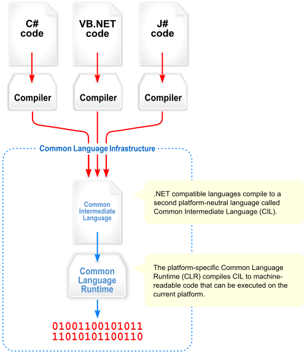

!SLIDE center fullscreen

#Overview

[Source](http://en.wikipedia.org/wiki/File:Overview_of_the_Common_Language_Infrastructure.svg)

!SLIDE center fullscreen

#Major Pieces
##Common Language Infrastructure
The Microsoft Implementation is called the CLR

The mono implementation is called mono.

##Common Intermediate Language

Defined in the CLI

##Common Type System

!SLIDE center fullscreen

#Standards Based

##ECMA and ISO standards

###ISO/IEC 23271:2006

###ECMA-335
